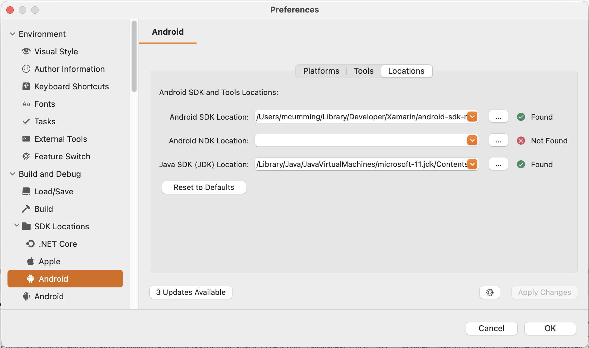

# OpenJDK binaries for Xamarin

_This guide describes the steps for switching to a supported distribution of OpenJDK._

## Overview

Beginning with Visual Studio 15.9 and Visual Studio for Mac 7.7, Visual Studio Tools for Xamarin has moved from Oracle’s JDK to a **lightweight version of the OpenJDK that is intended solely for Android development**. This is a required migration as Oracle is ending support for commercial distribution of JDK 8 in 2019, and JDK 8 is a required dependency for all Android development.

Beginning with Visual Studio 17.0 and Visual Studio for Mac 17.0, the Mobile Development workload has moved from OpenJDK 8 to OpenJDK 11. This is a required migration as the Android SDK is moving to JDK 11.

The benefits of this move are:

- You will always have an OpenJDK version that works for Android development.

- Downloading Oracle's JDK 9 or greater won’t affect the development experience.

- No more issues with 3rd party servers and installers.

If you’d like to move to the improved experience sooner, builds of the Microsoft Build of OpenJDK are available for you to test on both Windows and Mac at https://aka.ms/msopenjdk.

### Android Designer
The Android Designer, a visual designer for Android XML layout files, isn't compatible with the OpenJDK 11. It therefore uses a different distribution of the OpenJDK 8 in order to provide its functionality. The distribution in use is the Adoptium (https://adoptium.net) Temurin Open JDK 8. The JDK 8 is installed in the following locations:

- **Mac** &ndash; **$HOME/Library/Java/JavaVirtualMachines/temurin-8.jdk**
- **Windows** &ndash; **C:\\Program Files\\Eclipse Foundation\\jdk-8.0.302.8-hotspot**

## Download

The Microsoft Build of OpenJDK is automatically installed for you if you select the Android SDK packages in the Visual Studio installer on Windows.

On Mac, the Microsoft Build of OpenJDK will be installed for you as part of the Android workload for new installs. For existing Visual Studio for Mac users, you will be prompted to install it as part of your update. The IDE will prompt you to move to the new JDK, and will switch to using it at the next restart.

## Troubleshooting

If you encounter issues with the setup on Mac or Windows, you can take the following steps for manual setup:

Check if OpenJDK is installed on the machine in the correct location:

- **Mac** &ndash; **$HOME/Library/Java/JavaVirtualMachines/microsoft-11.jdk**
- **Windows** &ndash; **C:\\Program Files\\Microsoft\\jdk\\jdk-11.0.XX.YY-hotspot**

### Point the IDE to the new JDK:

- **Mac** &ndash; select **Tools > SDK Manager > Locations** and change the **Java SDK (JDK) Location** to the full path of the OpenJDK installation. In the following example, this path is set to  **$HOME/Library/Java/JavaVirtualMachines/microsoft-11.jdk/Contents/Home**.

- **Windows** &ndash; select **Tools > Options > Xamarin > Android Settings** and change the **Java Development Kit Location** to the full path of the OpenJDK installation. In the following example, this path is set to **C:\\Program Files\\Microsoft\\jdk\\jdk-11.0.12.7-hotspot**, but your version may be newer:

## Known Issues

No known issues.

## Summary

In this article, you learned how to configure your IDE to use the Microsoft Build of OpenJDK, and how to troubleshoot should you encounter issues.
